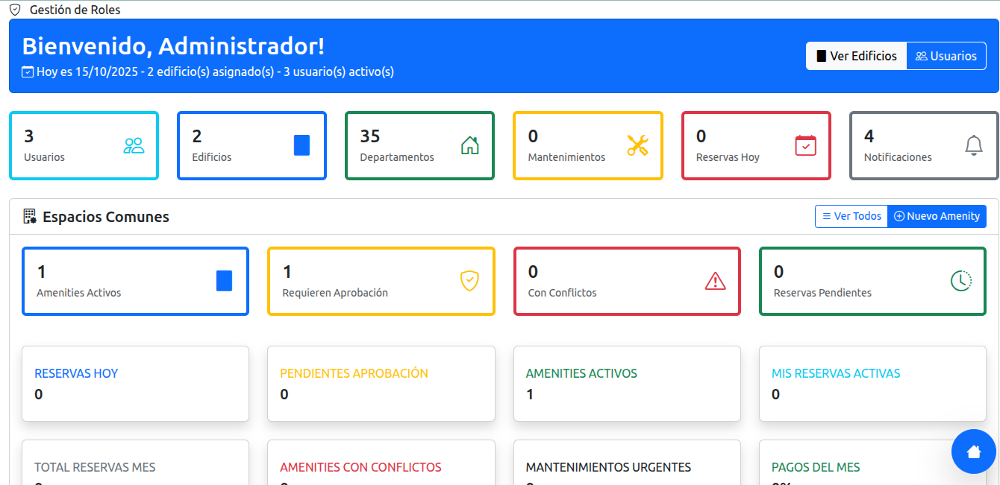
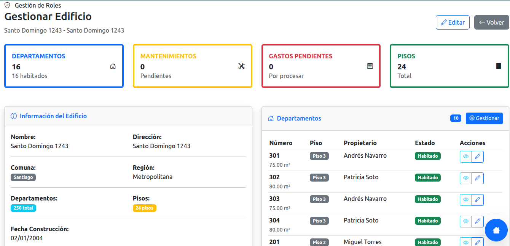
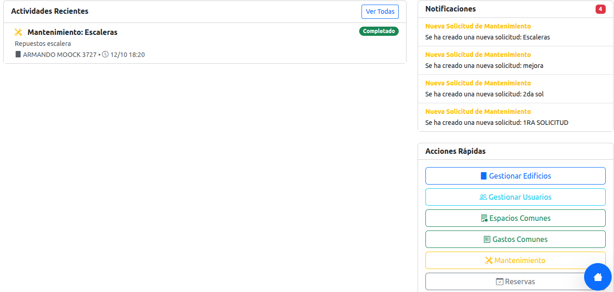
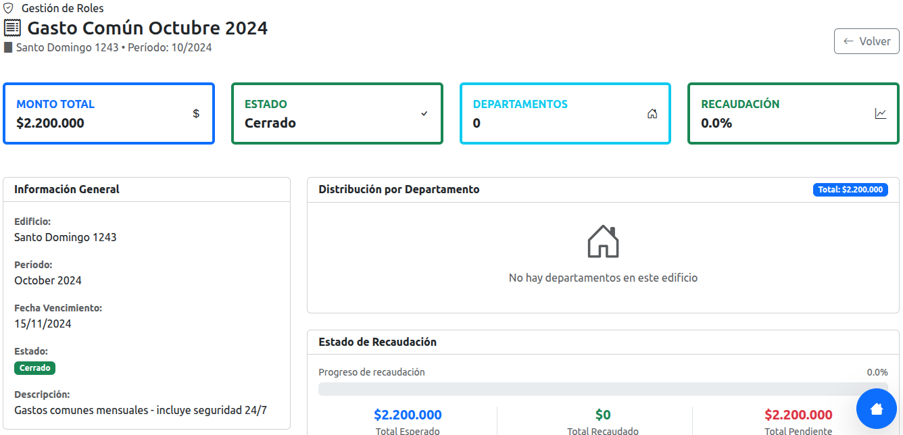
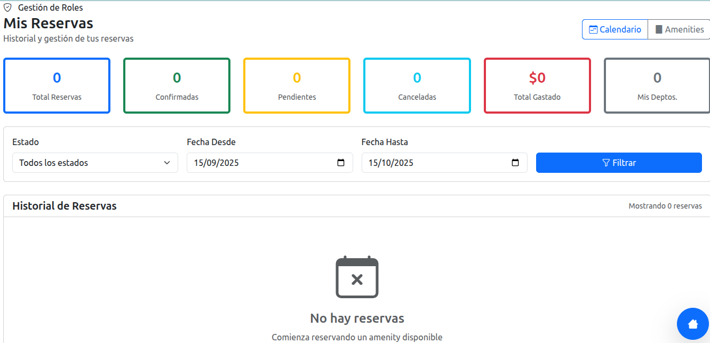

# 🏢 Sistema de Administración de Edificios - Chile (SAE-CL)

<p align="center">
  
  
  
  
</p>

> Sistema modular completo para la administración y gestión eficiente de edificios y condominios residenciales en Chile. Diseñado para optimizar procesos administrativos, financieros y operativos.

---

## ✨ Características Destacadas

Hemos organizado las funcionalidades en módulos clave para ofrecer una administración integral y sin fisuras.

### 🏗️ Gestión y Estructura

| Característica | Descripción |
| :--- | :--- |
| **Multiedificio** | Administración completa de múltiples propiedades de forma centralizada. |
| **Departamentos** | Gestión detallada de unidades, pisos y áreas comunes. |
| **Residentes** | Información completa de propietarios, arrendatarios y sus relaciones. |

### 💰 Módulo Financiero Avanzado

Un motor financiero potente para el control total de los recursos.

* **Sistema de Gastos Comunes**: Cálculo y distribución **automática** y precisa.
* **Prorrateo Inteligente**: Múltiples estrategias de distribución de costos configurables.
* **Gestión de Pagos**: Seguimiento en tiempo real de estados de cuenta y morosidad.
* **Reportes Financieros**: Balances, estados de cuenta y análisis detallados.

### 🎯 Control de Amenities (Espacios Comunes)

* **Reservas en Línea**: Sistema intuitivo para la reserva de gimnasio, piscina, quincho, etc.
* **Gestión de Reglas**: Control de horarios, capacidad y costos asociados.
* **Validación**: Sistema de aprobaciones y calendario integrado.

### 🔧 Mantenimiento y Proveedores

* **Solicitudes (Preventivo/Correctivo)**: Creación y seguimiento de tickets de mantenimiento.
* **Historial Completo**: Registro de intervenciones, costos y proveedores.
* **Priorización**: Asignación de estados y niveles de urgencia.

### 👥 Gestión de Usuarios y Roles

Sistema granular de permisos para una operación segura.

* **Roles Definidos**: Super Admin, Administrador, Comité, Conserje, Residente.
* **Autenticación Segura**: Relaciones directas Usuario-Edificio.
* **Control de Acceso**: Permisos por módulo y funcionalidad.

### 📊 Dashboard Integral

Una vista centralizada para la toma de decisiones.

* Métricas **en tiempo real** y KPIs importantes.
* Panel de Actividades recientes.
* Alertas y notificaciones (reservas, morosidad, mantenimientos).

---

## 🛠️ Stack Tecnológico

El proyecto está construido con un stack robusto y probado:

| Componente | Versión / Tecnología | Descripción |
| :--- | :--- | :--- |
| **Backend** | PHP 8.0+ | Lenguaje principal del servidor. |
| **Base de Datos** | MySQL 8.0 | Gestión de datos relacional de alto rendimiento. |
| **Frontend** | Bootstrap 5.x | Framework moderno para un diseño responsivo. |
| **Servidor Web** | Apache | Servidor HTTP estándar. |

## 📦 Estructura del Proyecto

Una arquitectura limpia y modular para facilitar el desarrollo y mantenimiento:

---

> **SAE-CL** es una solución modular y completa, diseñada específicamente para optimizar la **administración y gestión integral** de edificios residenciales en Chile. Simplifica procesos administrativos, financieros y operativos.

---

## ✨ Características Principales (Core Features)

Hemos agrupado las funcionalidades bajo módulos potentes para ofrecer una experiencia de gestión superior:

### ⚙️ Módulo de Estructura y Gestión
| Característica | Descripción Clave |
| :--- | :--- |
| **Multiedificio** | Administración centralizada de **múltiples** edificios y condominios. |
| **Control de Unidades** | Gestión de departamentos, pisos, y asignación de unidades a residentes. |
| **Residentes Detallados** | Ficha completa de **propietarios y arrendatarios**. |

### 💰 Módulo Financiero: La Columna Vertebral
El sistema ofrece un control financiero robusto y automatizado:

* **Sistema de Gastos Comunes Automatizado**
    * Cálculo y distribución **automática** y precisa.
* **Prorrateo Inteligente**
    * Soporte para **múltiples estrategias** de distribución de costos.
* **Gestión de Pagos**
    * Seguimiento de estados de cuenta, **alerta de morosidad** y balances.
* **Reportes de Alto Nivel**
    * Generación instantánea de **Balances y Estados de Cuenta**.

### 🏖️ Control de Amenities (Espacios Comunes)
Sistema de reservas moderno y con reglas de uso claras:

* **Reserva Online**
    * Piscina, Gimnasio, Quinchos y más.
* **Validación y Calendario**
    * Control de horarios, capacidad y flujo de aprobaciones.

### 🛠️ Mantenimiento y Proveedores
Gestión de incidentes y mantenimiento preventivo/correctivo:

* **Solicitudes (Tickets)**
    * Creación y seguimiento de tickets con prioridades.
* **Historial Completo**
    * Control de proveedores, costos y seguimiento de estados.

### 👥 Gestión de Acceso y Seguridad (RBAC)
Modelo de roles y permisos granular para una operación segura:

* **Roles Clave**: Super Admin, **Administrador**, Comité, Conserje, **Residente**.
* **Autenticación** y control de acceso por módulo.

---

## 💻 Stack Tecnológico

| Componente | Versión | Propósito |
| :--- | :--- | :--- |
| **Backend** | **PHP 8.0+** | Lenguaje de servidor robusto y de alto rendimiento. |
| **Base de Datos** | **MySQL 8.0** | Almacenamiento de datos relacional optimizado. |
| **Frontend** | **Bootstrap 5.x** | Framework de diseño para una interfaz moderna y responsiva. |
| **Seguridad** | **AES-256** | Encriptación de datos sensibles en reposo. |

---

## 📦 Estructura del Proyecto

Una visión organizada de la arquitectura **MVC Modular**:


edificios/
├── controllers/ # 🧭 Manejo de la lógica y peticiones
├── models/ # 💾 Interacción con la base de datos (DB)
├── views/ # 🖥️ Templates y la interfaz de usuario
├── core/ # 💡 Núcleo y funcionalidades base del sistema
├── modules/ # 🧩 Directorios para módulos especializados (p.ej. /finanzas)
├── config/ # ⚙️ Configuraciones de entorno y globales
├── assets/ # 🖼️ Recursos estáticos (CSS, JS, Fonts)
└── database/ # 📜 Esquemas SQL y migraciones

---

## 🚀 Guía de Instalación Rápida

### Requisitos Esenciales

1.  **PHP** versión **8.0** o superior.
2.  **MySQL** versión **8.0** o superior.
3.  Servidor **Apache** con `mod_rewrite` habilitado.
4.  **Composer** (gestor de dependencias de PHP).

### Pasos Detallados

1.  **Clonar el Repositorio:**
    ```bash
    git clone [url-del-repositorio]
    cd edificios
    ```

2.  **Preparar la Base de Datos:**
    ```bash
    # Ejecuta este script para crear la base de datos y las tablas necesarias
    source database/create_database.sql
    ```

3.  **Configuración del Entorno (`.env`):**
    ```bash
    # Copia la plantilla y edita las credenciales de DB
    cp config/.env_edificio .env
    # **Asegúrate de editar el archivo .env con tus credenciales de MySQL**
    ```

4.  **Asignar Permisos:**
    ```bash
    # Permisos de escritura para uploads de archivos y assets
    chmod 755 -R assets/ uploads/ 
    ```

5.  **Finalizar Setup:**
    * Accede a la URL del proyecto en tu navegador.
    * Completa el **asistente de setup inicial** (creación del primer usuario Super Admin).

---

## 🛡️ Estándares de Seguridad

Hemos implementado medidas de seguridad críticas para proteger la información:

| Mecanismo | Nivel de Protección |
| :--- | :--- |
| **Cifrado de Datos** | **AES-256** para datos críticos y sensibles. |
| **Validación Geográfica** | Validación estricta del **RUT chileno**. |
| **Modelo RBAC** | Control de Acceso Basado en Roles (Granular). |
| **Prevención de Ataques** | Protección contra **XSS** y **SQL Injection**. |
| **Auditoría** | **Log** de todas las acciones administrativas para trazabilidad. |

---

## 📸 Capturas de Pantalla (Previews)








| Vista | Descripción | Enlace |
| :--- | :--- | :--- |
| **Dashboard Principal** | Métrica en tiempo real y resumen de actividades. | `https://Edificios_001.png` |
| **Gestión de Edificios** | Panel de administración detallada de propiedades. | `https://Edificios_002.png` |
| **Módulo Financiero** | Control de Gastos Comunes y Estados de Pago. | `https://Edificios_004.png` |
| **Gestión de Usuarios** | Panel para la administración de cuentas y roles. | `https://Edificios_006.png` |

---

## 📜 Licencia

Este proyecto es de **código abierto** (Open Source) para uso y estudio. Por favor, consulte el archivo `LICENSE` para conocer los términos exactos y las restricciones para el uso comercial.

## 🤝 Soporte y Contacto


## 🛣️ Roadmap (Próximamente)

* **Integración con Webpay** (Pagos en línea).
* Desarrollo de una **App móvil nativa** (iOS/Android).
* **API REST** para integraciones avanzadas con terceros.
* Módulo de contabilidad y reportes avanzados.
